 # Kubernetes CI/CD Integration Suite

## **Project Description: Building and Deploying Artifacts on Kubernetes**  

This project focuses on designing and implementing a CI/CD pipeline to build and deploy application artifacts on a Kubernetes cluster. The primary goal is to automate the entire process, starting from code integration to deployment on a scalable, fault-tolerant Kubernetes environment, leveraging the best practices of DevOps and cloud-native technologies.  

## **Architecture**:
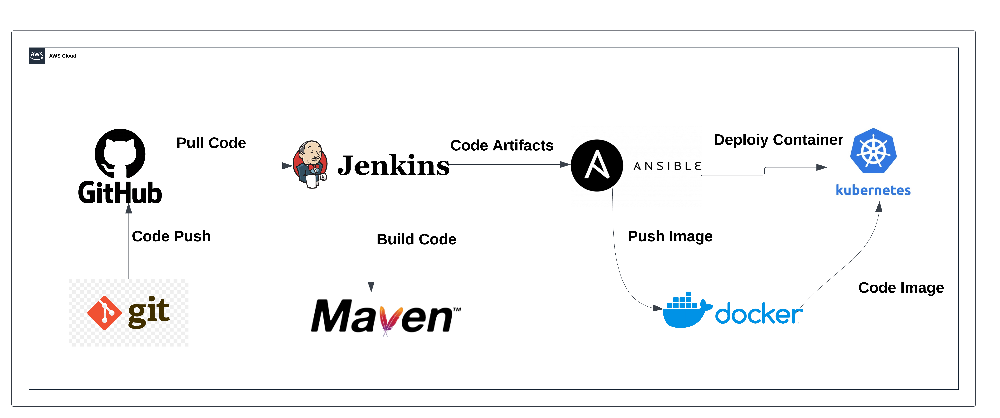

## **Tool Used**:

<a href="https://aws.amazon.com">
  
</a>
<a href="https://www.kernel.org">
  
</a>
<a href="https://git-scm.com">
  
</a>
<a href="https://github.com">
  
</a>
<a href="https://www.jenkins.io">
  
</a>
<a href="https://maven.apache.org">
  
</a>
<a href="https://github.com/tonistiigi/trivy">
  
</a>
<a href="https://www.docker.com">
  
</a>
<a href="https://www.ansible.com">
  
</a>
<a href="https://kubernetes.io">
  
</a>


### Key Highlights:
1. **CI/CD Integration**: The pipeline integrates tools like GitHub for version control, Jenkins for CI/CD orchestration, Maven for building artifacts, and Docker for containerization.  
2. **Kubernetes Deployment**: Applications are packaged and deployed as pods within a Kubernetes cluster, providing better scalability, reliability, and orchestration compared to traditional Docker hosts.  
3. **Kubernetes Setup**: The Kubernetes environment is manually set up to provide a robust infrastructure for deploying containerized applications, allowing fine-grained control over the cluster's configuration.  
4. **Infrastructure as Code**: Ansible playbooks are utilized for automating the setup of Kubernetes resources, including deployments and services, making the process repeatable and efficient.  
5. **Advantages over Docker-Only Deployments**: Unlike standalone Docker hosts, Kubernetes offers advanced features such as self-healing, load balancing, and rolling updates, ensuring high availability and minimal downtime for applications.  


### Note: Setting Up Kubernetes Environment on AWS   

#### Here's a step-by-step guide to set up Jenkins, Maven, and Docker on the **main server** and Kubernetes on a **secondary machine**:

## **Main Server Setup: Jenkins, Java, Maven, Docker, Git, Ansible, Trivy**

### **1. Install Jenkins**  
1. Update the system and install Java:  
   ```bash
   # Update and install prerequisites
    sudo yum update -y
    sudo yum install -y curl tar gzip wget vim 
    
    # JDK 17 installation
    echo "Installing Amazon Corretto JDK 17..."
    
    # Import the Corretto GPG key
    sudo rpm --import https://yum.corretto.aws/corretto.key
    
    # Add the Corretto repository
    sudo curl -L -o /etc/yum.repos.d/corretto.repo https://yum.corretto.aws/corretto.repo
    
    # Install Java 17
    sudo yum install -y java-17-amazon-corretto
    
    # Setting up JDK environment variables
    echo "Configuring Java environment variables..."
    echo "export JAVA_HOME=/usr/lib/jvm/java-17-amazon-corretto" | sudo tee -a /etc/profile
    echo "export PATH=\$PATH:\$JAVA_HOME/bin" | sudo tee -a /etc/profile
    
    # Source the profile to ensure environment variables are loaded
    source /etc/profile
    
    # Verify Java installation
    java -version
   ```
  
  2. Add the Jenkins repository and key:  
   ```bash
   echo "Installing Jenkins..."
   sudo wget -O /etc/yum.repos.d/jenkins.repo https://pkg.jenkins.io/redhat-stable/jenkins.repo
   sudo rpm --import https://pkg.jenkins.io/redhat-stable/jenkins.io.key
   ```
3. Install Jenkins:  
   ```bash
    sudo yum upgrade -y
    sudo yum install jenkins -y
    sudo systemctl enable jenkins --now
   ```
4. Access Jenkins via `http://<server-ip>:8080` and complete the setup.

---

### **2. Install Docker**
1. Install Docker:
   ```bash
    echo "Installing Docker..."
    sudo yum update -y
    sudo yum install docker -y
    sudo systemctl enable docker --now

2. Add Jenkins user to the `docker` group:
   ```bash
   sudo usermod -aG docker jenkins
   # To avoid permission denied while connecting to Docker socket
   sudo chmod 666 /var/run/docker.sock
   ```
3. Restart & verify jenkins service.
   ```bash
   sudo systemctl restart jenkins
   sudo systemctl status jenkins
   ```
   
### **3. Install Maven**
1. Install Maven using the package manager:
   ```bash
    echo "Downloading and installing Maven 3.9.9..."
    sudo wget https://dlcdn.apache.org/maven/maven-3/3.9.9/binaries/apache-maven-3.9.9-bin.tar.gz -P /tmp
    sudo tar -xzf /tmp/apache-maven-3.9.9-bin.tar.gz -C /opt
    ```
   
2. Create a symbolic link for Maven (optional, but recommended)
   ```bash
    sudo ln -s /opt/apache-maven-3.9.9 /opt/maven
    ```
   
3.  Configure environment variables for Maven
   ```bash
    sudo tee /etc/profile.d/maven.sh > /dev/null <<EOL
    # Apache Maven Environment Variables
    export JAVA_HOME=/usr/lib/jvm/java-17-amazon-corretto
    export M2_HOME=/opt/maven
    export MAVEN_HOME=/opt/maven
    export PATH=\${M2_HOME}/bin:\${PATH}
    EOL 
   ```

4. Modify file permissions for the Maven configuration script
   ```bash
    sudo chmod +x /etc/profile.d/maven.sh
   ```
    
5. Source the Maven configuration script to apply changes
  ```bash
    source /etc/profile.d/maven.sh
  ```
    
6.  Verify Maven installation
  ```bash
    mvn -version
  ```
    
### **4. Git Installation**
  ```bash
    sudo yum install -y git*
  ```

#4.1 If get error to install git . 
  ```bash
   sudo yum install git* -y --skip-broken
   ```

### **5. Install Trivy**
  ```bash
    echo "Installing Trivy..."
    # Add Trivy repository
    cat << EOF | sudo tee /etc/yum.repos.d/trivy.repo
    [trivy]
    name=Trivy repository
    baseurl=https://aquasecurity.github.io/trivy-repo/rpm/releases/\$basearch/
    gpgcheck=1
    enabled=1
    gpgkey=https://aquasecurity.github.io/trivy-repo/rpm/public.key
    EOF
    
    # Update the package list
    sudo yum -y update
    
    # Install Trivy
    sudo yum -y install trivy
    
    # Verify installation
    echo "Verify trivy installation."
    trivy --version
  ```

## **Install Ansible and Dependencies**

  ```bash
    echo "Installing Ansible and dependencies..."
    # Install Python 3, python-devel, python3-pip, and OpenSSL
    echo "Installing Python 3, python-devel, python3-pip, and OpenSSL..."
    sudo yum install -y python3 python3-devel python3-pip openssl
    
    # Install Ansible
    echo "Installing Ansible..."
    sudo amazon-linux-extras install ansible2 -y
    
    # Verify installations
    echo "Verifying installations..."
    python3 --version
    pip3 --version
    ansible --version
  ```
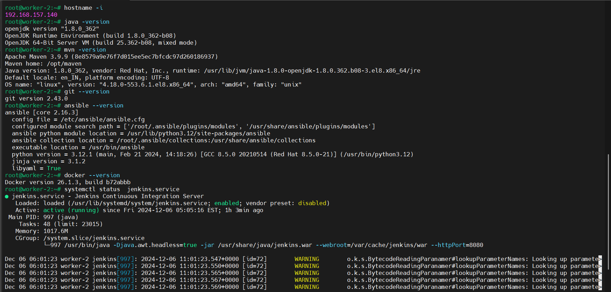

## Login to jenkins server using public ip of jenkins server through port 8080
```bash
http://<localhost:8080>
```
need to get the Administrator Password from /var/lib/jenkins/secrets/initialAdminPassword
```bash
sudo cat /var/lib/jenkins/secrets/initialAdminPassword
```
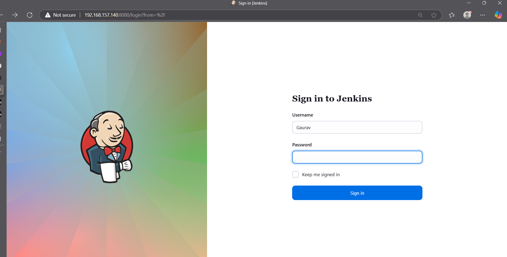

Successfully set up Jenkins server and logged in.

Next, proceed with installing plugins 
# Install plugins 
- **SSH Agent**
- **Plugin Maven** 
- **Pipeline: Stage View Plugin** 

# Configure credentials of docker hub, github, ansible-server in Jenkins Dashboard.

Dashboard > Manage Jenkins > Credentials > System > Global credentials (unrestricted) > Add credentials > New credentials > Kind: User

## Create Github token for Jenkins:
1. Go to github.com/ > User Settings > Developers Setting > Personal Access Tokens > Token (classic).
2. Generate new token > Generate new token (classic).
3. Prompt GitHub password.
4. New personal access token (classic): Note: Jenkins_project-1_token.
5. Expiration: 7 days.
6. Select scopes: Scopes define the access for personal tokens. For now, select all checkboxes.
7. Generate token and copy the token (because once the page refreshes, the token won't be visible any more).
8. Add the token to Jenkins Credentials:
   - Dashboard > Manage Jenkins > Credentials > System > Global credentials (unrestricted) > Add credentials.
   - Kind: Secret text.
   - Secret: Paste the GitHub token.
   - ID: github-token.

## Add Docker Hub credentials:
1. Dashboard > Manage Jenkins > Credentials > System > Global credentials (unrestricted) > Add credentials.
2. Kind: Username with password.
3. Username: Your Docker Hub username.
4. Password: Your Docker Hub password.
5. ID: docker-hub.

## Add Ansible server private key:

1. Create a private key using ssh-keygen:

    - Run ssh-keygen in the terminal.

    -  Save the key in the ~/.ssh directory.

2. Dashboard > Manage Jenkins > Credentials > System > Global credentials (unrestricted) > Add credentials.

3. Kind: SSH Username with private key.

4. Username: ansible.

5. Private Key: Paste the private key content from the generated file (e.g., ~/.ssh/id_rsa).

6. ID: ansible-private-key.


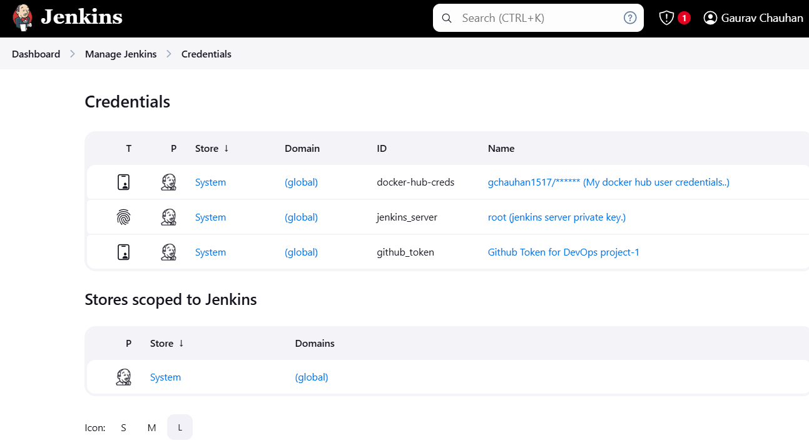

To copy an SSH key to a Kubernetes server for Ansible SSH authentication, you can follow these steps:

### 1. **Generate an SSH Key Pair (If You Don't Have One)**

If you haven't already generated an SSH key pair, you can do so by running:

```bash
ssh-keygen -t rsa -b 2048 -f ~/.ssh/id_rsa
```

This will generate an RSA SSH key pair with a 2048-bit key size. The private key will be saved to `~/.ssh/id_rsa` and the public key to `~/.ssh/id_rsa.pub`.

### 2. **Copy the Public SSH Key to the Kubernetes Server**

To enable Ansible to authenticate via SSH, you need to copy the public key to the Kubernetes server. Use the `ssh-copy-id` command or manually append the public key.

#### Using `ssh-copy-id`:
```bash
ssh-copy-id user@k8s-server
```
Replace `user` with the appropriate username and `k8s-server` with the IP address or hostname of your Kubernetes server.

#### Manually Adding the Public Key:
If `ssh-copy-id` is not available, you can manually copy the contents of the public key (`~/.ssh/id_rsa.pub`) and append it to the `~/.ssh/authorized_keys` file on the Kubernetes server:

1. Display the contents of the public key:
   ```bash
   cat ~/.ssh/id_rsa.pub
   ```
2. SSH into the Kubernetes server:
   ```bash
   ssh user@k8s-server
   ```
3. On the server, open or create the `~/.ssh/authorized_keys` file:
   ```bash
   mkdir -p ~/.ssh
   nano ~/.ssh/authorized_keys
   ```
4. Paste the contents of your public key into the `authorized_keys` file and save.

### 3. **Verify SSH Connection**

After copying the public key, verify that you can SSH into the Kubernetes server without needing a password:

```bash
ssh user@k8s-server
```

If you're able to log in without entering a password, SSH key authentication is set up correctly.

### 4. **Configure Ansible to Use SSH**

Ensure that your Ansible inventory is configured to use SSH for authentication. In your Ansible `inventory` file, you can specify the SSH user:

```ini
[kubernetes]
192.168.157.137
```

### 5. **Test Ansible SSH Connection**

Finally, test that Ansible can authenticate and connect to the Kubernetes server:

```bash
ansible k8s-server -m ping
```
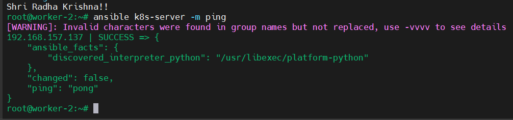

If everything is configured correctly, you should receive a successful "pong" response from Ansible.


   ## **MAIN MACHINE CONFIGURED SUCCESSFULLY!!** 


## **Secondary Machine Setup: Kubernetes**

### **1. Install Kubernetes Tools (kubectl, kubeadm, kubelet)**

# Install Docker
  ```bash
    # REF: https://docs.aws.amazon.com/eks/latest/userguide/install-kubectl.html
    sudo yum update -y
    sudo yum install -y docker
    sudo systemctl start docker
    sudo systemctl enable docker
    sudo chmod 777 /var/run/docker.sock
  ```
    
# Install Kubernetes components
```bash
    # REF: https://kubernetes.io/docs/setup/production-environment/tools/kubeadm/install-kubeadm/
    sudo setenforce 0
    sudo sed -i 's/^SELINUX=enforcing/SELINUX=permissive/' /etc/selinux/config
```
    
 ## Add Kubernetes repository
```bash
    cat <<EOF | sudo tee /etc/yum.repos.d/kubernetes.repo
    [kubernetes]
    name=Kubernetes
    baseurl=https://pkgs.k8s.io/core:/stable:/v1.29/rpm/
    enabled=1
    gpgcheck=1
    gpgkey=https://pkgs.k8s.io/core:/stable:/v1.29/rpm/repodata/repomd.xml.key
    EOF
```

## Install kubelet, kubeadm, and kubectl
```bash
    sudo yum install -y kubelet kubeadm kubectl --disableexcludes=kubernetes
    sudo systemctl enable --now kubelet
```
    
## Initialize Kubernetes cluster
```bash
    sudo kubeadm init --pod-network-cidr=10.244.0.0/16 --ignore-preflight-errors=NumCPU,Mem
```
    
## Configure kubectl for the root user
```bash
    mkdir -p $HOME/.kube
    sudo cp /etc/kubernetes/admin.conf $HOME/.kube/config
    sudo chown $(id -u):$(id -g) $HOME/.kube/config
```
    
## Deploy Calico network plugin
```bash
    kubectl apply -f https://docs.projectcalico.org/v3.18/manifests/calico.yaml
    
    # Deploy Tigera Operator (optional)
    kubectl apply -f https://raw.githubusercontent.com/projectcalico/calico/v3.27.0/manifests/tigera-operator.yaml
 ```   
## Remove taints from control-plane nodes (allow workloads on the master node)
```bash
    kubectl taint nodes $(hostname) node-role.kubernetes.io/control-plane:NoSchedule-
  ```

### Add Worker Nodes**
1. On worker nodes, join the cluster using the command provided during `kubeadm init`:
   ```bash
   sudo kubeadm join <master-ip>:6443 --token <token> \
   --discovery-token-ca-cert-hash sha256:<hash>
   ```

###  Verify Kubernetes Cluster**
1. Check nodes:
   ```bash
   kubectl get nodes
   ```
2. Ensure all pods are running:
   ```bash
   kubectl get pods -A
   ```
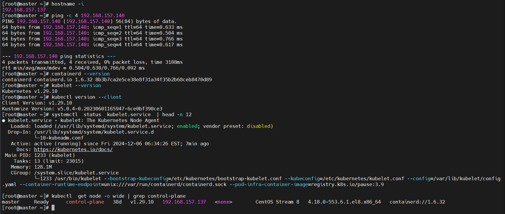 

Here’s a description of the CI pipeline in your `Jenkinsfile` for inclusion in a `README.md` file:

---

## CI Pipeline Overview

This Jenkins pipeline automates the process of building, testing, and deploying a Dockerized Java application using Maven. The pipeline consists of multiple stages to ensure that the application is thoroughly tested, built, and securely deployed to Docker Hub.

### Stages:

1. **Cleanup Workspace**:
    - This stage cleans up the Jenkins workspace to ensure no leftover files from previous builds.
    - **Step**: `cleanWs()`

2. **Git Checkout**:
    - The pipeline pulls the latest code from the `main` branch of the specified Git repository.
    - **Step**: `git branch: 'main', url: 'https://github.com/Gaurav1517/AWS-Examples.git'`

3. **Maven Unit Test**:
    - This stage runs unit tests on the code to check the functionality of individual units.
    - **Step**: `sh 'mvn test'`

4. **Maven Build**:
    - The code is compiled and packaged into a `.jar` file using Maven.
    - **Step**: `sh 'mvn clean install'`

5. **Maven Integration Test**:
    - This stage verifies that the application works as expected when different parts of the system interact.
    - **Step**: `sh 'mvn verify'`

6. **Docker Image Build**:
    - The pipeline navigates to the directory containing the `Dockerfile` and builds the Docker image.
    - The image is tagged using the Jenkins job name and build number.
    - **Step**: `sh "docker build -t ${JOB}:${BUILD_NUMBER} ."`

7. **Docker Image Tag**:
    - The Docker image is tagged with both the build number and the `latest` tag to make it easy to identify and pull.
    - **Step**: 
      ```bash
      sh "docker tag ${JOB}:${BUILD_NUMBER} ${DOCKER_USERNAME}/${JOB}:v${BUILD_NUMBER}"
      sh "docker tag ${JOB}:${BUILD_NUMBER} ${DOCKER_USERNAME}/${JOB}:latest"
      ```

8. **Trivy Image Scan**:
    - The pipeline scans the Docker image for vulnerabilities using **Trivy**, a security scanner.
    - The results are saved to an HTML file for reporting.
    - **Step**: `sh "trivy image --format table ${DOCKER_USERNAME}/${JOB}:v${BUILD_NUMBER} -o image-report.html"`

9. **Docker Image Push**:
    - The pipeline logs in to Docker Hub using the stored credentials and pushes the built Docker image to the repository.
    - Both the versioned image and the `latest` tag are pushed to Docker Hub.
    - **Step**:
      ```bash
      sh "docker login -u '${docker_user}' -p '${docker_pass}'"
      sh "docker push ${docker_user}/${JOB}:v${BUILD_NUMBER}"
      sh "docker push ${docker_user}/${JOB}:latest"
      ```

10. **Docker Image Cleanup**:
    - Unwanted Docker images are removed to free up space on the Jenkins server.
    - The cleanup process targets dangling images related to the project to ensure efficient resource usage.
    - **Step**: `sh 'docker images --format "{{.Repository}}:{{.Tag}}" | grep -E "^gchauhan1517|^demo" | xargs -r docker rmi -f'`

---

### Environment Variables:
- **DOCKER_USERNAME**: The Docker Hub username used for pushing the images to the registry.
    - **Example**: `"gchauhan1517"`

### Tools:
- **Maven**: Required for building and testing the Java project.

### Credentials:
- **docker-hub-creds**: The Jenkins credentials used for Docker Hub login.

---

This pipeline ensures that the Java application is continuously integrated with secure image scanning and efficient resource management. It also helps to automate the deployment of the application to Docker Hub for easy access and deployment.

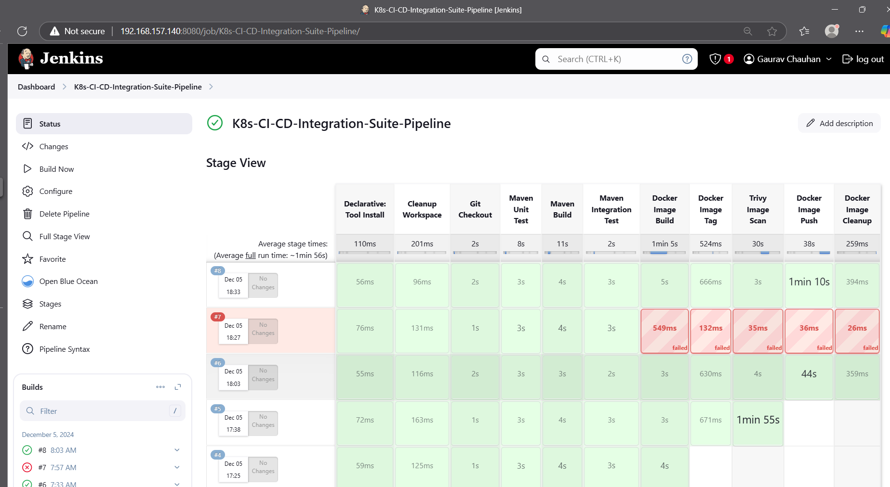

## Registry docker image 
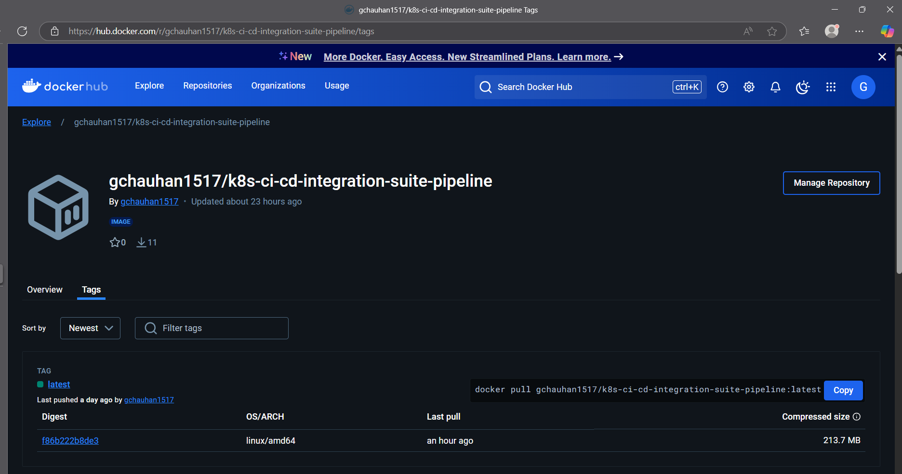

## CD Pipeline Overview

This Continuous Deployment (CD) pipeline automates the process of deploying an application to a Kubernetes cluster using `kubectl` commands. It interacts with an AWS EC2 instance and executes deployment tasks, all while ensuring that appropriate approvals are obtained before applying changes.

### Stages:

1. **Pull Files**:
    - In this stage, the pipeline pulls the necessary files for deployment from a Git repository or local workspace.
    - The pipeline uses an **Ansible playbook** to fetch and prepare files for the deployment process.
    - **Step**:
      ```bash
      sh "ansible-playbook -i /etc/ansible/hosts -u ${EC2_NAME} -e pipeline_name=${PIPELINE_NAME} /var/lib/jenkins/workspace/K8s-CI-CD-Integration-Suite-Pipeline/pull-files.yml"
      ```
    - The `sshagent` block is used to authenticate the SSH connection to the remote server via Jenkins credentials (`jenkins_server`).

2. **Approval**:
    - The pipeline waits for manual approval before proceeding with the deployment.
    - The **`input`** step pauses the pipeline execution and asks for confirmation: "Approve deployment?"
    - This ensures that no deployment happens without explicit consent from a user or administrator.

3. **Deployment**:
    - The deployment stage executes several commands on the target EC2 instance:
        1. The Kubernetes **deployment configuration** is applied via the `kubectl` command.
        2. The **service configuration** is applied to expose the application.
        3. The deployment is restarted using `kubectl rollout restart` to apply the changes.
        4. Finally, the service status is checked using `kubectl get service` to verify that the deployment was successful.
    - **Steps**:
      ```bash
      sh "ssh -o StrictHostKeyChecking=no ${EC2_NAME}@${NODE_IP} kubectl apply -f /root/k8s-manifest/deployment.yml"
      sh "ssh -o StrictHostKeyChecking=no ${EC2_NAME}@${NODE_IP} kubectl apply -f /root/k8s-manifest/service.yml"
      sh "ssh -o StrictHostKeyChecking=no ${EC2_NAME}@${NODE_IP} kubectl rollout restart deploy"
      sh "ssh -o StrictHostKeyChecking=no ${EC2_NAME}@${NODE_IP} kubectl get service"
      ```
    - The `sshagent` block is used again to authenticate the SSH connection, and the `StrictHostKeyChecking=no` option ensures that SSH does not prompt for verification of the host key.

---
### Environment Variables:
- **NODE_IP**: The private IP address of the target EC2 instance where the Kubernetes deployment will happen.
    - **Example**: `'192.168.157.137'`
- **EC2_NAME**: The SSH username for the EC2 instance.
    - **Example**: `'root'`
- **PIPELINE_NAME**: The name of the pipeline.
    - **Example**: `"K8s-CI-CD-Integration-Suite-Pipeline"`
- **PROJECT_NAME**: The name of the project being deployed.
    - **Example**: `"DevopsProject1"`

### Credentials:
- **jenkins_server**: The Jenkins credentials used for SSH access to the EC2 instance.
---

This CD pipeline ensures that the application is deployed to the Kubernetes cluster only after a successful file pull, followed by an approval step. The deployment process is automated and verified with the appropriate checks, ensuring a smooth and efficient deployment to production.

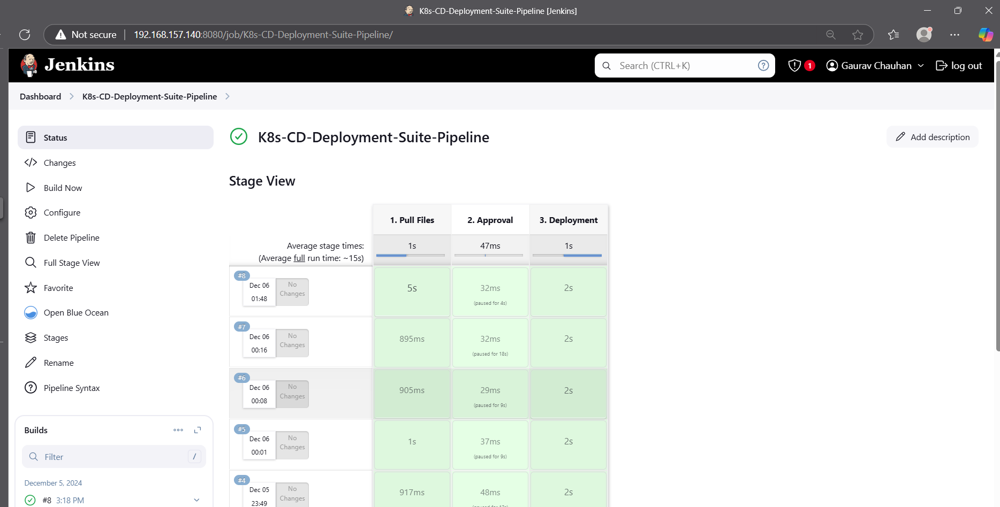

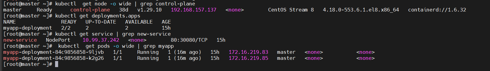

## **Get acces application with kubernetes server ip and service port.**
http://<<k8s-server:service-port/webapp>>

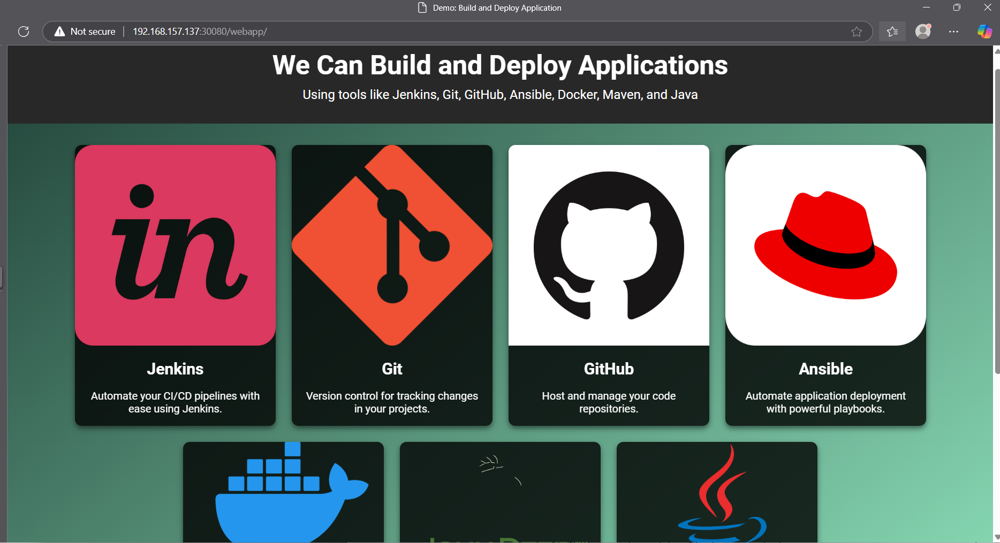
